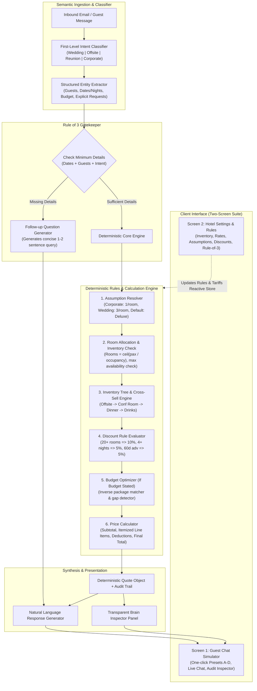

# Autonomous Hotel Group Booking Assistant
## System Architecture & Technical Specification

---

### 1. Architectural Overview & Data Flow

The system is designed with a strict separation of concerns: **Semantic AI Layer for natural language understanding and communication**, and an **Isolated Deterministic Rules Engine for 100% auditable, hallucination-free pricing and allocation**.

---

### 2. The "Rule of 3" Minimum Details Strategy

To reach the first quote in the minimum number of email round-trips (Turn 1 whenever possible):

#### Mandatory Requirements (Must be present to generate a quote):
1. **Guest Count**: Determines room block size, dining scale, and conference hall capacity.
2. **Dates / Duration (Nights)**: Multiplier for accommodation and daily hall rentals, plus eligibility for advance booking discounts.
3. **Booking Type / Intent**: Dictates the occupancy density assumption (1/room for corporate vs 3/room for weddings) and triggers the appropriate inventory tree branch.

#### Optional Requirements (Resolved via transparent assumptions):
*   **Room Category**: Defaulted to `Deluxe` (₹5,000/night).
*   **Occupancy Density**: Corporate = 1 person/room; Wedding = 3 persons/room (maximum capacity).
*   **Conference / Event Space**: Auto-selected based on smallest capacity >= guest count.
*   **Food & Beverage**: Defaulted to `Classic Veg` (₹1,200/pax) or `Wedding Feast` (₹3,000/pax).
*   **Extras / Decor**: Suggested as distinct cross-sell line items.

---

### 3. Inventory & Pricing Matrix (PDF Default Configuration)

#### Accommodation
| Room Type | Max Occupancy | Sample Price / Night | Total Inventory |
|---|---|---|---|
| **Deluxe** | 3 pax | ₹5,000 | 40 rooms |
| **Super Deluxe** | 3 pax | ₹7,500 | 25 rooms |
| **Suite** | 3 pax | ₹12,000 | 10 rooms |

#### Event & Meeting Facilities
| Conference Room | Capacity | Price / Day | Best Fit For |
|---|---|---|---|
| **Boardroom** | 15 pax | ₹15,000 | Small executive meetings <= 15 pax |
| **Summit Hall** | 50 pax | ₹40,000 | Mid-size offsites / workshops (16–50 pax) |
| **Grand Hall** | 200 pax | ₹1,20,000 | Weddings & large conventions (51–200 pax) |

#### Dining & Packages
| Package | Description | Price / Person |
|---|---|---|
| **Classic Veg** | Vegetarian buffet | ₹1,200 |
| **Classic Non-Veg**| Veg & non-veg buffet | ₹1,500 |
| **Premium Buffet** | Live counters, desserts | ₹2,200 |
| **Wedding Feast** | Premium menu, served style | ₹3,000 |
| **Drinks Package**| Per-person beverage package | ₹1,000 |
| **Wedding Decor** | Standard luxury floral/stage decor | ₹1,50,000 (flat) |

---

### 4. Deterministic Discount Rules
1. **Volume Discount**: >= 20 rooms => 10% discount on room tariff.
2. **Extended Stay**: >= 4 nights => 5% discount on room tariff.
3. **Early Bird / Advance Booking**: >= 60 days in advance => 5% discount on total quote.

---

### 5. Benchmark Scenario Verification
*   **Email A (Missing details)**: Triggers follow-up query asking specifically for December dates and estimated headcount.
*   **Email B (Corporate Offsite, 30 pax, 2 nights)**: Quotes 30 Deluxe rooms (1 pax/room) with 10% volume discount, Summit Hall for 2 days, and Classic Veg dinner.
*   **Email C (Wedding, 90 pax, 3 nights)**: Quotes 30 Deluxe rooms (3 pax/room) with 10% room volume discount + 5% advance booking discount, Grand Hall, Wedding Feast, Decor, and Suite recommendation.
*   **Email D (Budget-based, ₹3L for 25 pax, 2 nights)**: Uses inverse solver to craft a ₹2,40,000 package (9 Deluxe rooms, Summit Hall, dinner & drinks) leaving a comfortable ₹60,000 buffer.
